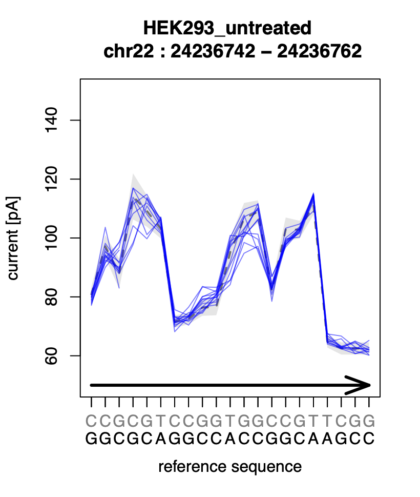
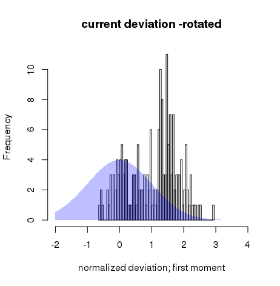
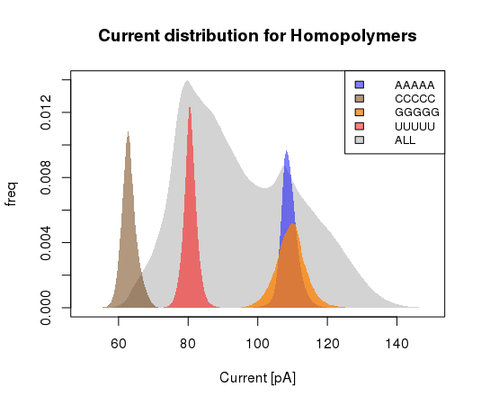
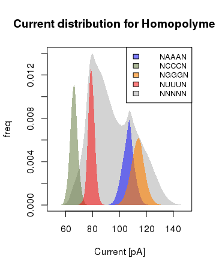
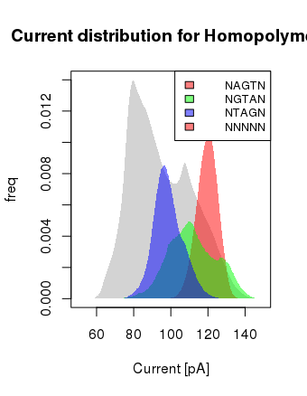

<!-- language: lang-none -->
     _   _                         _
    | \ | |                       (_)
    |  \| | __ _ _ __   ___  _ __  _ _ __   ___ _ __
    | . ` |/ _` | '_ \ / _ \| '_ \| | '_ \ / _ \ '__|
    | |\  | (_| | | | | (_) | |_) | | |_) |  __/ |
    \_| \_/\__,_|_| |_|\___/| .__/|_| .__/ \___|_|
                            | |     | |
                            |_|     |_|              

---

This pipeline processes raw nanopore data (e.g. from the minION device) and runs parallel processing pipelines for base-called data, as well as raw current. It aligns reads in bam and GRangeslist format, and profiles current data along regions of interest.

Two examples of figures output by the pipeline are provided below. The first figure shows current profile over a genomic region of interest, while the second shows systematic deviation of such currents from the expected normal distribution of current profiles predicted by sequence alone.

<table><tr>
<td> 
<td> 
</tr></table>

The motivation for this type of analysis, of course, is to detect possible modifications, as, indeed, the latter figure is drawn from a putative modification site.
The pipeline also collects various other statistics, for example on the distribution of currents for various motifs and kmers, as illustrated below:

<table><tr>
<td> 
<td> 
<td> 
</tr></table>

Here, the first two figures show current distributions of k=5 homopolymers in the context of the sum over all possible sequences (grey background), emphasizing the importance of the central three bases. The latter figure shows current distribution profiles with conserved bases, showing order-dependence.

Such plots can have an important pedagogical significance in understanding and working with raw current data from nanopore devices.
A consolidated final report (the contents of which are under continuing
development) Contains numerous other figures and reports tailored to the users input and regions of interest.

## How to use this package

To run the program, first edit the config file `config.json`, as described
below. You will need to supply a reference file populated with regions of interest against which you wish to analyse the current of the reads (if none is supplied, this section is simply skipped). You must also provide  the location of a reference genome, the genome version and paths to input and output folders.

Before running the pipeline, you will need to configure your executables. The pipeline was initially built using guix, and if you are working from the MDC in Berlin, then everything is already setup for this purpose --otherwise, adapting the manifest .scm file to a requirements file will be necessary (please get in touch if you require assistance with this.)

Assuming you are using guix, navigate to the repository's subfolder `dev/guix` and create your environment from the manifest file that is provided using the following command:

`{guix} package -p $PWD/.guix-profile -m manifest.scm`

or, alternatively, just use:

`source generate_env_from_manifest.sh`

(Since this file simply contains the above command). Guix will then go about
preparing the dependencies that you will need to run the pipeline in a
bespoke environment which can then be used whenever you want. This will take
some time, but only needs to be done once; go for lunch while it's running.

Once that's finished, for any future terminal session in which you want to run
the pipeline, you should navigate to the `guix` subfolder and type:

`source load_env.sh`

to load your environment. Assuming your config file is setup (see below), you
should then  be able to run the pipeline (see below).

This pipeline is a work in progress, (note the version number) and feedback is
welcome; if you encounter any problems, please post an issue.

## Config file

You will want to specify the following variables before runtime.

| Variable name | description |
| ------------- |:-----------:|
| PATHIN        | string: Required: location of source data.
| PATHOUT       | string: Required: location of output path to be written to.
| ReadType    | Type of read under analysis. For now, this should always be "ONT_Direct_RNA", but other strand types will be added in time.
| samplelist    | list of samples with identifying name (RUN_ID), and the "sampledir" which provides the name of the subdirectory for this dataset within "PATHIN".
| ref           | data regarding the reference --e.g. "Genome_Dir": Path to the reference genome; "Genome_version": name thereof, "RsoI_abspath": path to the directory containing regions of interest. And finally, "RsoI": RDS file containing regions of interest (in a specialized format).
| Execution     | target_out Desired output of the pipeline; e.g. a "bam"; the read data with alignment, in Granges List format "reads_GRL", among various other possibilities. "jobs": max number of rule executions to be run simultaneously. "clustersub": should this task be submitted to an SGE cluster (true/false).

The remaining options can generally be left to their default values, defined  in
`dev/config_defaults.json`

## Interpreter

You may also need to add a specific path to the interpreter on your machine
at the first line of the file nanopiper.py to your instance of python3.
This is a temporary solution until a more standard installation process is
established.

## Execution

Once the above have been completed, you should be able to navigate to the folder
in which you've saved this repository, and enter:

`./nanopiper.py -c config_batch_all.json -n`

The `-n` flag signifies a dry-run to confirm that everything is configured in place to run correctly. If no red errors appear when you do you this, then you are ready to run the real thing.

## Credits and Thanks

The most important feature of this pipeline relies heavily on nanopolish, for which I should thank Jared Simpson (see https://github.com/jts/nanopolish).
